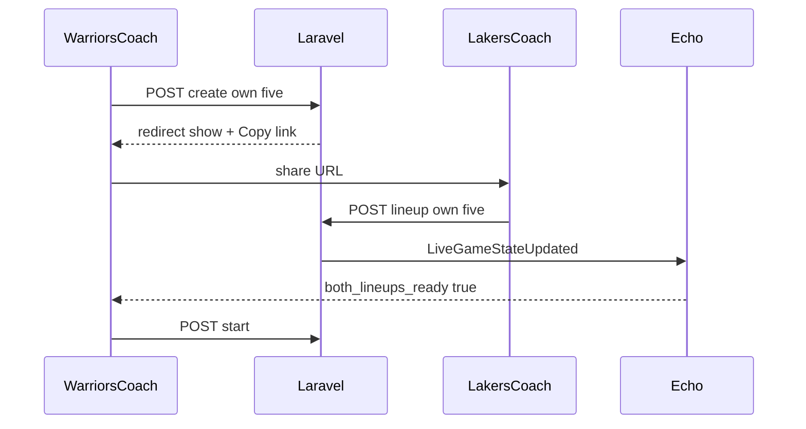

# Dual-Coach Live Game Setup Implementation Plan

> **For agentic workers:** REQUIRED SUB-SKILL: Use superpowers:subagent-driven-development (recommended) or superpowers:executing-plans to implement this plan task-by-task. Steps use checkbox (`- [ ]`) syntax for tracking.

**Goal:** Fix live-game create so a team-tied coach only picks their own five, shares a URL for the opponent coach to submit theirs, soft-defaults from Comparison AI lineup, and blocks Start until both lineups are ready.

**Architecture:** Creator’s `users.team_id` becomes `home_team_id`. Create persists home starting five only (`opponent_*` null until join). Opponent coach opens `/live-games/{id}`, submits their five via a dedicated lineup endpoint that broadcasts `LiveGameStateUpdated`. Creator Start is gated until both fives exist. Comparison “Confirm lineup” navigates to Create with query params that soft-preselect player IDs.

**Tech Stack:** Laravel 13, Inertia React/TS, Reverb/Echo (existing), Pest.

## Global Constraints

- Home team = creator’s `team_id` (no home-team dropdown for coaches).
- Creator selects: opponent team, period length, **own five only**.
- Joiner selects: **own five only** via shared URL (`/live-games/{id}`).
- Join mechanism: Copy link only (no join code MVP).
- Comparison AI lineup = soft default (editable), via query params / navigation from Confirm.
- Start enabled only when both starting fives are present (size 5 each).
- Waiting UI syncs via existing Echo snapshot.
- Preserve existing dual-team live scoring rules (own-team events, creator clock).
- Do not modify `Components/ui/` shadcn bases.
- Tablet-first (768–1024): large Copy link CTA, clear waiting empty state.

## Out of scope

- Join codes
- Hard-locked AI lineups
- 3+3 coach player assignment
- Changing comparison Python algorithm

---

## File Structure

| File | Role |
|------|------|
| [`app/Http/Controllers/LiveGameController.php`](app/Http/Controllers/LiveGameController.php) | Team-scoped create; `submitLineup`; Start gate; create props |
| [`routes/web.php`](routes/web.php) | `POST live-games/{liveGame}/lineup` |
| [`resources/js/Pages/LiveGames/Create.tsx`](resources/js/Pages/LiveGames/Create.tsx) | Own-team-only UI; home locked; copy link after redirect handled on Show |
| [`resources/js/Pages/LiveGames/Show.tsx`](resources/js/Pages/LiveGames/Show.tsx) | Setup waiting UI; lineup submit form; Copy link; Start disabled until ready |
| [`resources/js/Components/features/lineup/LineupModal.tsx`](resources/js/Components/features/lineup/LineupModal.tsx) | Confirm → navigate to create with player IDs |
| [`resources/js/Pages/Comparison/Show.tsx`](resources/js/Pages/Comparison/Show.tsx) | Pass comparison team ids into modal CTA |
| [`app/Services/LiveGame/LiveGameClockService.php`](app/Services/LiveGame/LiveGameClockService.php) / start path | Reject start if opponent five missing |
| [`app/Services/LiveGame/LiveGameStateBuilder.php`](app/Services/LiveGame/LiveGameStateBuilder.php) | Snapshot flags: `home_lineup_ready`, `opponent_lineup_ready`, `both_lineups_ready` |
| [`resources/js/types/index.ts`](resources/js/types/index.ts) | Snapshot readiness fields |
| Tests under `tests/Feature/LiveGame/` | Create scoped, submit lineup, start gate, comparison query |

### Locked interfaces

```php
// Create store payload (coach with team_id)
// home_team_id inferred from auth user — not client-trusted without server check
'opponent_team_id' => required,
'period_length_seconds' => required,
'starting_player_ids' => required size 5 from home team,
// opponent_starting_player_ids NOT required at create — stored null

// POST /live-games/{liveGame}/lineup
'starting_player_ids' => required array size 5
// Server writes home or opponent columns based on LiveGame::sideFor($user)

// Start gate
both starting arrays non-null and count === 5
```

```ts
// Create query soft-default
/live-games/create?opponent_team_id=1&player_ids=32,3,30,0,11

snapshot: {
  home_lineup_ready: boolean;
  opponent_lineup_ready: boolean;
  both_lineups_ready: boolean;
}
```



---

### Task 1: Team-scoped create API

**Files:**
- Modify: `LiveGameController::create`, `store`
- Test: `tests/Feature/LiveGame/LiveGameControllerTest.php`

**Interfaces:**
- Consumes: `$user->team_id`
- Produces: game with `home_team_id = user.team_id`, opponent five null

- [ ] **Step 1: Write failing tests**

```php
// Warriors coach create: home forced to GSW; only starting_player_ids required
// assert opponent_starting_player_ids is null
// user without team_id cannot create (422)
// cannot set home_team_id to a different team via request tampering
```

- [ ] **Step 2: Run — expect FAIL**

Run: `php artisan test --filter=LiveGameControllerTest`

- [ ] **Step 3: Implement**

`create` props: `homeTeam` (user’s team + players), `opponentTeams` (other active teams), optional `preselectedPlayerIds` from request query.  
`store`: require `$user->team_id`; set `home_team_id` from user; validate five from home only; leave opponent lineup null.

- [ ] **Step 4: Pass tests**

- [ ] **Step 5: Commit**

```bash
git commit -m "$(cat <<'EOF'
Scope live-game create to the coach's team and defer opponent lineup.

EOF
)"
```

---

### Task 2: Create UI — own lineup only

**Files:**
- Modify: `resources/js/Pages/LiveGames/Create.tsx`

- [ ] **Step 1: Manual/UX acceptance criteria as test comments + feature inertia props test**

Assert create page has `homeTeam`, not dual editable opponent picker.

- [ ] **Step 2: Implement UI**

- Show home team name (read-only), opponent select, period, **one** lineup grid.
- Preselect from `preselectedPlayerIds` if present, else first 5.
- Remove opponent lineup section from create.
- Disable submit unless 5 selected + opponent chosen.
- Touch targets ≥44px; Copy link comes after redirect on Show (Task 4).

- [ ] **Step 3: `npm run typecheck`**

- [ ] **Step 4: Commit**

```bash
git commit -m "$(cat <<'EOF'
Show only the coach's lineup on live-game create.

EOF
)"
```

---

### Task 3: Submit lineup endpoint + broadcast

**Files:**
- Modify: `LiveGameController` (new `submitLineup`), `routes/web.php`, `LiveGameStateBuilder`
- Test: feature test for joiner submit

- [ ] **Step 1: Failing test**

```php
// Lakers coach POSTs five → opponent_starting/active filled
// Warriors coach cannot overwrite opponent five via this endpoint for wrong side
// Non-participant 403/422
// Broadcast LiveGameStateUpdated fired
```

- [ ] **Step 2: Run — expect FAIL**

- [ ] **Step 3: Implement**

```php
public function submitLineup(Request $request, LiveGame $liveGame, LiveGameStateBuilder $stateBuilder)
```

Only while `status === setup`.  
Map side → columns.  
Rebuild snapshot flags; `event(new LiveGameStateUpdated(...))`.  
Allow creator to update home five while still setup; joiner updates opponent five.

- [ ] **Step 4: Pass tests + commit**

```bash
git commit -m "$(cat <<'EOF'
Allow each coach to submit their starting five during live-game setup.

EOF
)"
```

---

### Task 4: Show setup waiting UI + Copy link + Start gate

**Files:**
- Modify: `Show.tsx`, `LiveGameClockService` / `start`, `GameScoreboard` if needed
- Test: start rejected until opponent five present

- [ ] **Step 1: Failing start test**

```php
// creator start with null opponent five → 422
// after opponent lineup submitted → start OK
```

- [ ] **Step 2: Implement UI**

While `setup`:
- If own five missing: lineup picker + Submit lineup.
- If own five present, other missing: “Waiting for {opponent} lineup…” + **Copy link** button (`navigator.clipboard.writeText(window.location.href)` + toast/success text).
- If both ready: enable Start (creator only).
- Echo updates readiness from snapshot.

- [ ] **Step 3: Pass tests + typecheck + commit**

```bash
git commit -m "$(cat <<'EOF'
Gate live-game start on both lineups and add setup waiting UX.

EOF
)"
```

---

### Task 5: Comparison soft-default into Create

**Files:**
- Modify: `LineupModal.tsx`, `Comparison/Show.tsx`
- Test: optional feature/browser-free unit on query parsing; controller create passes `preselectedPlayerIds`

- [ ] **Step 1: Failing inertia/create prop test**

`GET /live-games/create?opponent_team_id=1&player_ids=a,b,c,d,e` → props include those IDs (validated as belonging to home team).

- [ ] **Step 2: Implement**

LineupModal Confirm CTA → `router.visit(route('live-games.create', { opponent_team_id, player_ids: ids.join(',') }))`  
Only enable if logged-in user’s team matches the comparison home team being recommended (or always pass and let create ignore invalid IDs).

- [ ] **Step 3: Pass + commit**

```bash
git commit -m "$(cat <<'EOF'
Preselect live-game starters from comparison recommended lineup.

EOF
)"
```

---

### Task 6: Regression + docs

- [ ] **Step 1:** `php artisan test --filter=LiveGame`
- [ ] **Step 2:** Fix dual-five create tests that still require opponent five at create
- [ ] **Step 3:** Update [`docs/live-game-1plus1-sync-checklist.md`](docs/live-game-1plus1-sync-checklist.md) with create → share → join → wait → start steps
- [ ] **Step 4:** `vendor/bin/pint --dirty` && `npm run typecheck`
- [ ] **Step 5: Commit**

```bash
git commit -m "$(cat <<'EOF'
Update LiveGame tests and 1+1 checklist for dual-coach setup.

EOF
)"
```

---

## Manual success criteria

1. Login `warriors@email.com` → Create shows GSW only (no Lakers picker).
2. Optional: Comparison Confirm → Create with AI five prechecked.
3. Create → Show shows Copy link; Start disabled; waiting for Lakers.
4. Login `lakers@email.com` → open shared URL → submit five Lakers.
5. Warriors device updates via Echo; Start enabled; Start begins live scoring.
